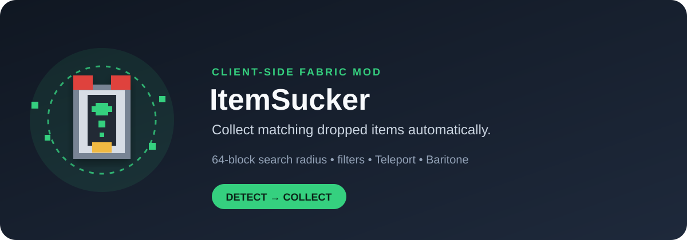
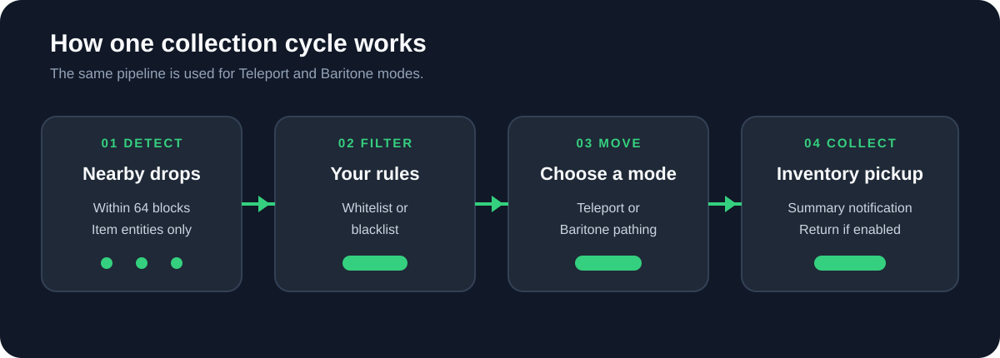
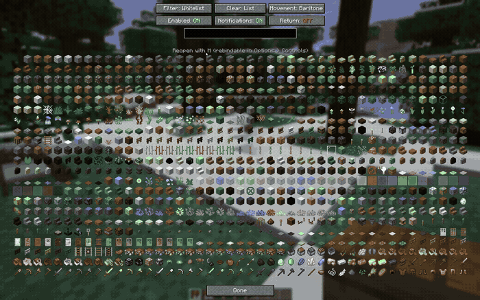
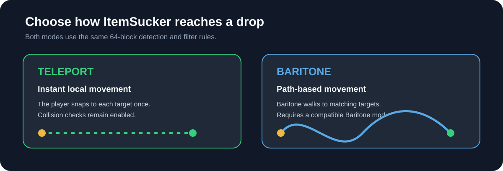

<div align="center">

# ItemSucker


**Automatically collect matching dropped items in Minecraft.**

[Created by **sgor**](https://github.com/sgor-ai)

[](https://www.minecraft.net/)
[](https://fabricmc.net/)
[](https://adoptium.net/)
[](LICENSE)

</div>

<p align="center">
  
</p>

<p align="center"><strong>Choose what to collect, choose how to move, and let ItemSucker handle the pickup.</strong></p>

> **ItemSucker is a client-side Fabric mod for Minecraft 26.2.** It detects
> dropped item entities within a fixed 64-block radius, applies your filter,
> moves close enough to matching items, and optionally returns to where the
> collection session started.

## Overview

ItemSucker continuously checks nearby dropped items and compares them with the
active filter:

- **Whitelist** collects only the items you select.
- **Blacklist** collects everything except the items you select.
- **Teleport** moves instantly to each matching item.
- **Baritone** uses optional path-based movement instead.

The mod is designed for a clear, predictable flow:

<p align="center">
  
</p>

The search radius is intentionally fixed at **64 blocks**. Internal checks for
grounded items, pickup delay and teleport collisions remain enabled; they are
not exposed as unsafe runtime switches.

## Demo

This is the complete supplied screen recording from beginning to end:



## Features

- Fixed 64-block collection radius.
- Whitelist and blacklist item filters.
- Teleport mode with stable target selection and collision checks.
- Optional Baritone mode for path-based movement.
- Searchable and scrollable item-selection GUI.
- Stable green/red selection highlighting.
- Optional return to the starting position after a collection session.
- Optional end-of-session collection summary.
- Mod Menu configuration screen.
- Keybind for opening the GUI and configurable toggle keybind.
- English and Italian translations.
- Client-only: no server-side installation is required.

## Requirements

- Minecraft **26.2**
- [Fabric API `0.161.0+26.2`](https://github.com/FabricMC/fabric-api/releases/tag/0.161.0%2B26.2)
- Java **25 or newer**

Optional:

- [Baritone Meteor — Minecraft 26.2 branch](https://github.com/MeteorDevelopment/baritone/tree/26.2)
  for `/itemsucker move baritone`
- [Mod Menu](https://modrinth.com/mod/modmenu/versions) for opening
  ItemSucker from the Mods screen

The Fabric **profile/loader is installed automatically by the official Fabric
Launcher installer** and is not a separate mod JAR requirement. Download the
installer from [fabricmc.net/use/installer](https://fabricmc.net/use/installer/).

ItemSucker starts without Baritone or Mod Menu. If Baritone is not installed,
Teleport mode remains available and Baritone mode cannot be selected.

## Installation

1. Install the Minecraft 26.2 Fabric profile with the
   [official Fabric installer](https://fabricmc.net/use/installer/).
2. Download the [Fabric API `0.161.0+26.2` JAR](https://github.com/FabricMC/fabric-api/releases/tag/0.161.0%2B26.2)
   and put it in your Minecraft `mods` folder.
3. Download `itemsucker-26.2-1.0.0.jar` from the
   [latest ItemSucker release](../../releases/latest), or build it from source.
4. Put the ItemSucker JAR in the same `mods` folder:
   - **Windows:** `%appdata%\.minecraft\mods`
   - **Linux:** `~/.minecraft/mods`
   - **macOS:** `~/Library/Application Support/minecraft/mods`
5. If you want Baritone movement, build or download the compatible
   [Baritone 26.2 build](https://github.com/MeteorDevelopment/baritone/tree/26.2)
   and put its JAR in the same folder.
6. If you want the Mods-menu configuration screen, install a compatible
   [Mod Menu release](https://modrinth.com/mod/modmenu/versions) for Minecraft
   26.2.
7. Launch the Fabric 26.2 profile.

The source folder itself does not belong in `.minecraft/mods`; Minecraft loads
the compiled JAR.

## Usage

### First setup

1. Enter a world where automated movement is allowed.
2. Open the selector with `/itemsucker gui` or press **M**.
3. Choose **Whitelist** or **Blacklist**.
4. Search for items and click them to select or deselect them.
5. Press **Done** to save.
6. Choose a movement mode.
7. Enable ItemSucker with `/itemsucker on`.

### Commands

```text
/itemsucker                    Toggle ItemSucker
/itemsucker on                 Enable collection
/itemsucker off                Disable collection
/itemsucker toggle             Toggle collection
/itemsucker gui                Open the item-selection GUI
/itemsucker mode whitelist     Collect only selected items
/itemsucker mode blacklist     Exclude selected items
/itemsucker move teleport      Use instant movement
/itemsucker move baritone      Use Baritone pathing
/itemsucker return on          Return after the collection session
/itemsucker return off         Stay at the last collected item
/itemsucker return toggle      Toggle return-to-origin
/itemsucker notify on          Show collection summaries
/itemsucker notify off         Hide collection summaries
```

The old `ground`, `pickupable`, `collision-check` and configurable `range`
commands are intentionally not part of the current interface.

### Keybinds

- **M** opens the ItemSucker item-selection screen.
- The toggle key is unassigned by default and can be configured under
  **Options → Controls**.

### Movement modes

<p align="center">
  
</p>

**Teleport** moves the local player directly to each matching item. A target
is handled once instead of causing repeated per-tick repositioning.

**Baritone** sends matching item targets to Baritone and lets it path to them.
The goal is refreshed when targets change or when a periodic refresh is needed.
Baritone mode requires a compatible Baritone installation.

## At a glance

| What you want | How ItemSucker helps |
| --- | --- |
| Collect only specific drops | Use Whitelist mode |
| Ignore unwanted drops | Use Blacklist mode |
| Collect within a large area | Searches a fixed 64-block radius |
| Move instantly | Select Teleport mode |
| Walk to items naturally | Select Baritone mode |
| Return after collecting | Enable return-to-origin |
| See what was collected | Enable pickup notifications |

## Configuration

Settings are saved automatically to:

```text
.minecraft/config/itemsucker.json
```

The GUI and commands control the supported settings. The collection radius is
always 64 blocks, and the internal safety checks remain enabled by design.

## Building from source

Clone the repository and run the Gradle wrapper:

```bash
git clone https://github.com/sgor-ai/Item-sucker.git
cd Item-sucker
./gradlew clean build
```

On Windows:

```powershell
.\gradlew.bat clean build
```

The compiled mod is written to:

```text
build/libs/itemsucker-26.2-1.0.0.jar
```

To launch a development client with the local Baritone and Mod Menu
dependencies:

```powershell
.\gradlew.bat runClient
```

The first build downloads Minecraft, Fabric and Loom dependencies. The local
JARs in `libs/` are used for the reproducible development environment and are
not bundled into ItemSucker.

## Project layout

```text
src/main/java/com/itemsucker/  Core logic, commands, GUI and integrations
src/main/resources/             Fabric metadata, icon and translations
libs/                           Local development dependencies
docs/images/                    README artwork and complete demo GIF
```

## Responsible use

Teleport mode changes the local player position instantly. Baritone mode
automates pathing. Both modes may be disallowed by multiplayer server rules or
trigger anti-cheat systems. Use ItemSucker only in single-player or where
automation is explicitly permitted. The authors are not responsible for kicks,
bans, lost items or other server-side consequences.

## Troubleshooting

### ItemSucker does not appear in Minecraft

Confirm that the JAR is in the correct `mods` folder, that you launched the
Fabric profile, and that Minecraft, Fabric API and Fabric Loader all match
version 26.2.

### Baritone mode cannot be selected

Install a compatible Baritone Meteor JAR in the same `mods` folder and restart
Minecraft. Teleport mode does not require Baritone.

### The GUI does not open

Use `/itemsucker gui` from inside a world. If you want the **M** key, check
**Options → Controls** for conflicts and assign the ItemSucker keybind.

### The build cannot find Java 25

Install a Java 25 JDK and make sure `JAVA_HOME` points to it. Minecraft 26.2
requires Java 25 for this project.

## Contributing

Issues and pull requests are welcome. Include the Minecraft version, Fabric
Loader version, relevant log output and reproducible steps when reporting a
problem.

## Creator

ItemSucker is created and maintained by [sgor](https://github.com/sgor-ai).

## License

ItemSucker is released under the [MIT License](LICENSE). It is not affiliated
with Mojang, Microsoft, Fabric, Meteor or Baritone.
